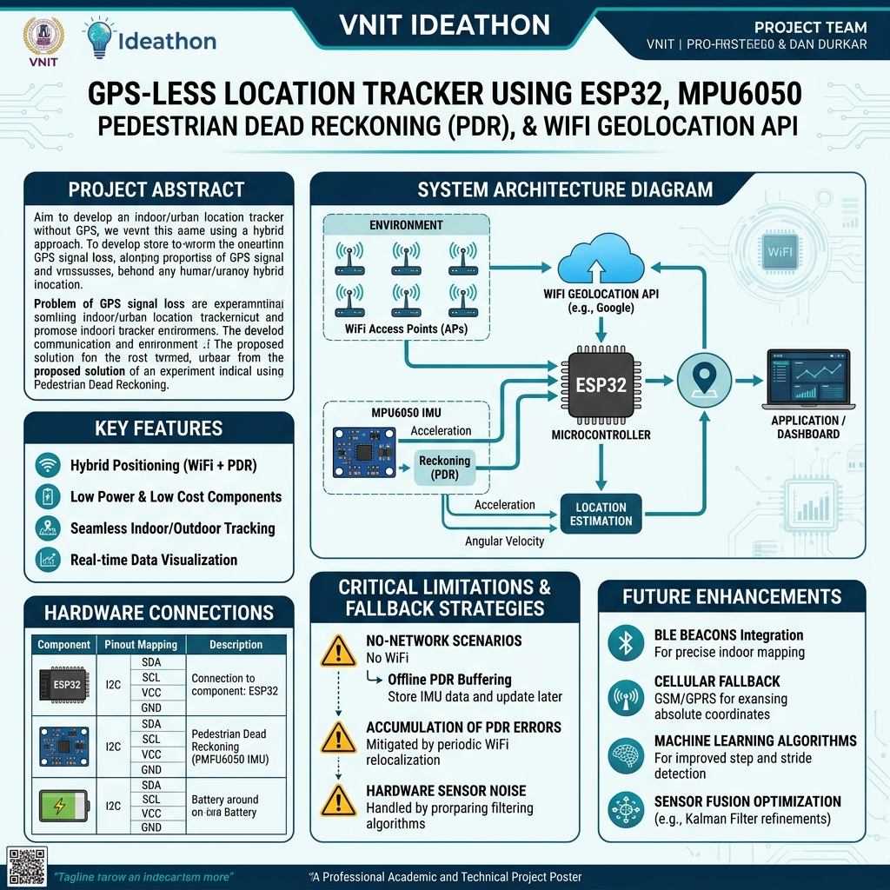

# 📍 GPS-Less Location Tracker (ESP32 + MPU6050 + WiFi Geolocation)

> **VNIT Ideathon Project Documentation**  
> *A hybrid localization system designed for indoor/dense urban environments using WiFi Fingerprinting and Inertial Pedestrian Dead Reckoning (PDR).*



---

## 📌 Executive Summary & Pitch Overview

Standard GPS receivers often fail indoors, in dense urban canyons, or under heavy cloud/roof coverage due to direct line-of-sight signal degradation (attenuation). Furthermore, dedicated GPS modules increase hardware cost and power draw. 

This project implements a **GPS-Less Localization Tracker** using an **ESP32 microcontroller** paired with an **MPU6050 6-axis IMU**. It fuses two core positioning strategies:
1. **Absolute Location (WiFi Geolocation API)**: Periodically scans nearby BSSIDs (WiFi APs) and queries the Google Geolocation API over HTTPS to establish a high-level latitude/longitude origin.
2. **Relative Movement (Inertial Pedestrian Dead Reckoning - PDR)**: Tracks step detection (via acceleration magnitude thresholding) and heading angle (integrated gyro $Z$-axis) to estimate micro-movements between WiFi fixes.

---

## 🏗️ System Architecture & Workflow

```mermaid
graph TD
    subgraph Absolute Location Fix
        A[ESP32 WiFi Scan] -->|Collect MACs & RSSI| B[Google Geolocation API]
        B -->|Return Lat/Lng Origin| C[Origin Calibration]
    end

    subgraph Inertial Motion Tracking (PDR)
        D[MPU6050 Accelerometer] -->|Magnitude Peak| E[Step Detection]
        F[MPU6050 Gyroscope Z-axis] -->|dt Integration| G[Heading Angle θ]
        E & G --> H[Dead Reckoning ΔX, ΔY]
    end

    C & H --> I[Current Estimated Lat/Lng Coordinate]
```

### Mathematical Model

1. **Step Movement Displacement:**
   $$\Delta X_{\text{East}} = S_{\text{length}} \times \sin(\theta)$$
   $$\Delta Y_{\text{North}} = S_{\text{length}} \times \cos(\theta)$$
   *where $S_{\text{length}} = 0.70\text{ m}$ (stride length) and $\theta$ is heading in radians.*

2. **Geographic Coordinate Translation:**
   $$\text{Lat}_{\text{current}} = \text{Lat}_{\text{origin}} + \left(\frac{\Delta Y}{111,320\text{ m/deg}}\right)$$
   $$\text{Lng}_{\text{current}} = \text{Lng}_{\text{origin}} + \left(\frac{\Delta X}{111,320\text{ m/deg} \times \cos(\text{Lat}_{\text{origin}})}\right)$$

---

## 🔌 Hardware Connections & Wiring

| ESP32 Pin | MPU6050 Module Pin | Description |
| :--- | :--- | :--- |
| **3.3V** | VCC | 3.3V Power Supply |
| **GND** | GND | Common Ground |
| **GPIO 21** | SDA | I2C Data Line (Wire.h) |
| **GPIO 22** | SCL | I2C Clock Line (Wire.h) |

---

## ⚡ Critical Limitations & Trade-offs (Ideathon Evaluation Focus)

> [!WARNING]
> ### 🚨 Key Bottleneck: WiFi Dependency & Zero-Network Scenarios
> **Problem:** When the ESP32 is out of range of registered WiFi networks (e.g., remote outdoor areas, basements, or network outages), **the Google Geolocation API cannot return an absolute position fix**.
>
> **System Impact:**
> - Without an initial fix (`originLat = 0, originLng = 0`), PDR can only report relative displacements $(\Delta X, \Delta Y)$ in meters from an unknown origin.
> - **Inertial Drift Accumulation:** Over prolonged periods without WiFi recalibration, gyroscope Z-axis bias drift causes cumulative error in heading $\theta$, leading to position divergence.

### 🛡️ Proposed Mitigation Strategies (Pitch Solutions)

If presenters are questioned on **"What happens when there is no internet/network?"**, present these engineered solutions:

1. **Local Offline Relative Vector Logging:**
   - Store offline steps and vector movements in ESP32 Flash SPIFFS/NVS memory.
   - When connection is re-established, retroactive trajectory mapping is computed from the newly received origin fix.
2. **Cellular (GSM/NB-IoT) Tower Triangulation Fallback:**
   - Add a low-cost SIM800L module to perform Cell-ID location lookup when WiFi AP density is sparse.
3. **Bluetooth Low Energy (BLE) Indoor Beacons:**
   - Deploy fixed RSSI BLE beacons inside buildings to act as offline local origin points.
4. **Sensor Fusion Enhancement (MPU9250 Magnetometer):**
   - Incorporate a 3-axis magnetometer (compass) to eliminate continuous gyro integration drift.

---

## 📁 Repository File Structure

- `GPS_Tracker.ino`: Main executable ESP32 code featuring direct I2C MPU6050 register access, zero-rate gyro offset calibration, step detection, and ArduinoJson v6/v7 compatible WiFi API handling.
- `secrets.h`: Protected configuration file containing WiFi credentials (`WIFI_SSID`, `WIFI_PASSWORD`) and Google Cloud API key (`GOOGLE_API_KEY`).

---

## 🚀 Foolproof Step-by-Step Execution Guide (Laptop & ESP32 Setup)

### 🔹 STEP 1: Hardware Connections (Wiring)
Connect the **MPU6050 sensor** to your **ESP32** using female-to-female jumper wires:
- **MPU VCC** ➔ **ESP32 3.3V** (Powers sensor)
- **MPU GND** ➔ **ESP32 GND** (Common Ground)
- **MPU SDA** ➔ **ESP32 GPIO 21** (I2C Data Line)
- **MPU SCL** ➔ **ESP32 GPIO 22** (I2C Clock Line)
- Plug the ESP32 into your laptop using a USB data cable.

---

### 🔹 STEP 2: Turn ON Wi-Fi / Hotspot
1. Turn **ON** Mobile Hotspot on your phone (SSID: `iPhone`, Password: `atkaresam123`).
2. Connect your **Laptop** to this **same Mobile Hotspot / Wi-Fi network**.
   *(Both ESP32 and Laptop MUST be on the exact same Wi-Fi network).*

---

### 🔹 STEP 3: Start the Python Dashboard Server on Laptop
1. Open **Command Prompt** / Terminal on your laptop in the project directory.
2. Run the command:
   ```bash
   python dashboard_server.py
   ```
3. Look at the text printed in the terminal:
   ```text
   ESP32 Telemetry Dashboard running at: http://localhost:8000/
   ESP32 Telemetry Endpoint: http://192.168.XX.XX:8000/api/telemetry
   ```
4. **Note down the IP address printed after `http://`** (e.g., `192.168.29.27` or `192.168.1.15`).

---

### 🔹 STEP 4: Update Laptop IP in Arduino IDE (`GPS_Tracker.ino`)
1. Open **Arduino IDE** and load `GPS_Tracker.ino`.
2. Look at **line 18** at the top of the code:
   ```cpp
   const char* DASHBOARD_SERVER_URL = "http://YOUR_LAPTOP_IP:8000/api/telemetry";
   ```
3. Replace **`YOUR_LAPTOP_IP`** with the IP address noted from **Step 3**:
   ```cpp
   const char* DASHBOARD_SERVER_URL = "http://192.168.29.27:8000/api/telemetry";
   ```

---

### 🔹 STEP 5: Upload Code to ESP32
1. In Arduino IDE, go to `Tools` ➔ `Board` ➔ `esp32` ➔ select **ESP32 Dev Module**.
2. Go to `Tools` ➔ `Port` ➔ select your ESP32 **COM Port** (e.g., `COM3` / `COM4`).
3. Click the **Upload button (➔)** in Arduino IDE.
4. Wait until it displays **"Done uploading"**.

---

### 🔹 STEP 6: Open Browser & View Live Map Tracking!
1. Open **Google Chrome** or **Edge** on your laptop.
2. Navigate to: **`http://localhost:8000/`**
3. Open **Serial Monitor** in Arduino IDE (`Tools` ➔ `Serial Monitor`) set to **115200 Baud**.
4. Hold the sensor and start walking / moving it around:
   - The status badge on the dashboard will turn **Green** (`RECEIVING TELEMETRY`).
   - The **blue marker will move live across the map**, drawing your real-time walk trajectory!

---

## 🎓 Ideathon Pitch Q&A Cheat-Sheet for Presenters

1. **Q: Why use this over a traditional GPS module (e.g., NEO-6M)?**
   - *A:* Lower unit cost, zero startup time (cold-fix delay), lower power overhead, and works inside concrete buildings where GPS satellite signals are blocked.
2. **Q: How accurate is step-based dead reckoning?**
   - *A:* PDR is accurate over short distances ($\sim 1\text{--}5$ meters), but requires periodic absolute origin recalibration via WiFi API every 8--15 seconds to correct drift.
3. **Q: How does the system handle missing internet/WiFi?**
   - *A:* The tracker switches to pure relative tracking $(\Delta X, \Delta Y)$ and buffers movement vectors locally until a network or BLE beacon origin is found.